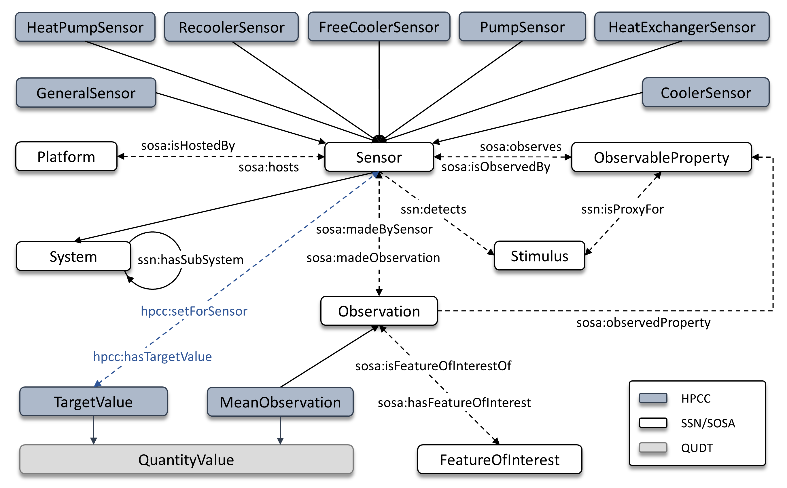

# HPCCool - A Semantic Framework for HPC Cooling Management and Advanced Analytics


HPCCool is a semantic integration framework that bridges ontological system representations with raw sensory data in HPC cooling environments. At its core, the framework incorporates the HPCC ontology, which formally models HPC cooling management systems, including thermal exchange units, cooling devices, valves, and pumps, as observed through a distributed sensor network. HPCCool builds upon an ontology-based data access (OBDA) engine (Ontop), enabling R2RML mappings between ontological entities and relational data sources.

## HPCC Ontology:

<p align="center">
  
  <br><em>HPCC Ontology: The core concepts and semantic relationships</em>
</p>

The HPCC Ontology provides a semantic model for representing HPC thermal management telemetry. It extends the W3C SSN/SOSA standard to capture HPC cooling concepts, including heat pumps, heat exchangers, pumps, coolers, and re-coolers. Designed for the datacenter thermal management domain, the ontology supports anomaly detection, real-time condition monitoring, and advanced system analytics.


## Ontology Documentation:

Ontology Specification with permanent `w3id.org/hpcc` identifier:

[](https://paitools.github.io/HPCCOntology/docs/index-en.html)

## HPCCool User Guide

Running **HPCCool** on user hardware involves two steps:

1. **Populate the Knowledge Graph Matrix (KGM)**
2. **Deploy the Framework**


### 1. KGM Population

1. Open the `KGM_Template.xlsx` within the `KGM` folder.
   
2. Populate the template with project-specific instances. If needed, use the provided KGM as a reference.

3. Rename `KGM_Template.xlsx` to `KGM.xlsx` and store it in the same folder.

   


### 2. HPCCool Deployment

- After completing the KGM, set the `data_structure` to your HPC thermal logging structure (e.g., `raw/*/*/*.csv`).
  
- Deploy the framework:
  ```bash
  python3 HPCCool.py

### Running SPARQL

- To run SPARQL queries (e.g., `user_query.rq`) on real-time data:

   ```bash
   ontop.bat query -p ontop.properties -m mapping.ttl -q user_query.rq

Requirements

- DuckDB ≥ `1.0.0`
- Ontop client ≥ `5.3.0`

Ensure both are installed before running the framework. 
If compatibility issues occur, use the exact versions listed above.

## Changing Logging Structure and File Format

Let's say we want to change the logging path to a different structure or directory (e.g., `/home/logs/*.parquet`).

Like before, in the HPCCool.py source code, set the `data_structure` to the new logging structure `/home/logs/*.parquet`

However, this time, the file format is changed from `csv` to `parquet` and we need to change the message log reading function accordingly.

Now, search for messagelog view and change the `read_csv_auto()` function to `read_parquet()`. Notice that `data_structure` will also receive the newly configured value.

Save the changes and redeploy the framework:

```bash
python3 HPCCool.py
```

Result: HPCCool now operates with the new logging structure and `parquet` file format.


### Supported Formats

| Format   | Function         |
|----------|------------------|
| csv      | read_csv_auto()  |
| json     | read_json()      |
| tsv      | read_csv_auto()  |
| parquet  | read_parquet()   |
| jsonl    | read_ndjson()    |

## License

All resources are licensed under the [Creative Commons Attribution-NonCommercial-ShareAlike 4.0 International](https://creativecommons.org/licenses/by-nc-sa/4.0/) license.


## Citation

Ivanovic, P., & Wanniarachchi, S. (2026). paitools/HPCCOntology: HPCCool/HPCC v1.0: Pre-publication Release. Zenodo. https://doi.org/10.5281/zenodo.19947986
